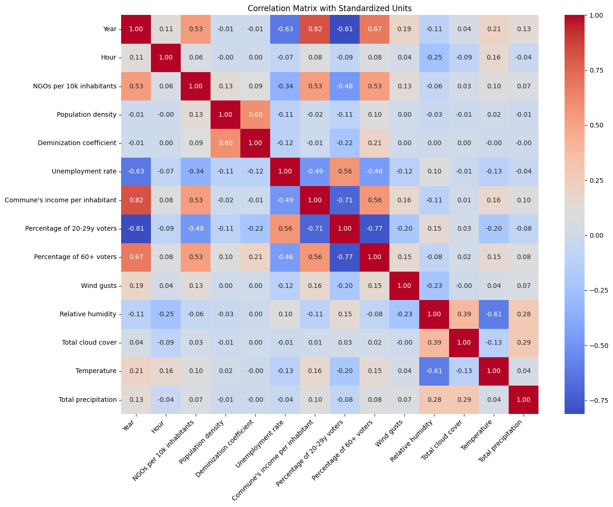
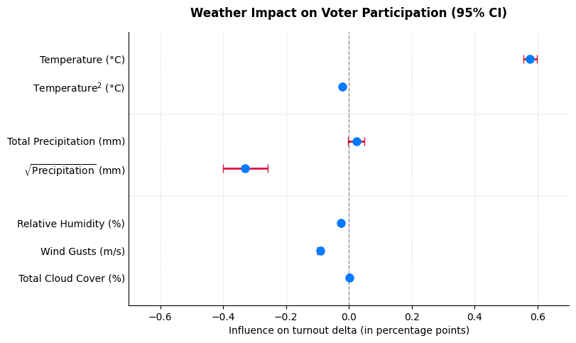
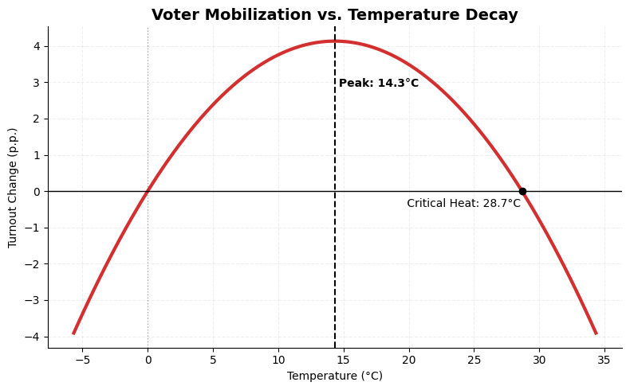
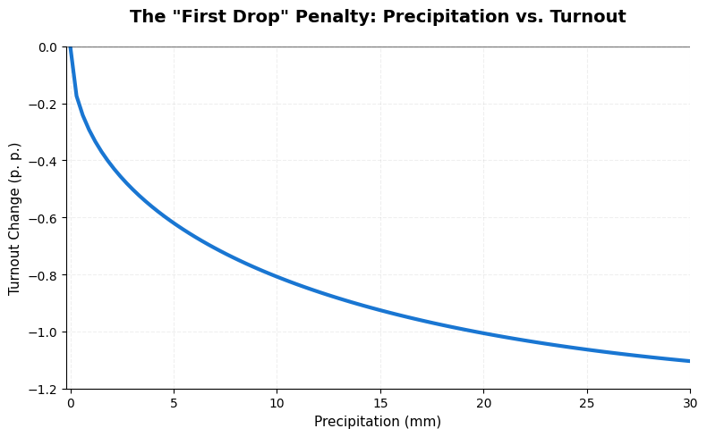

# Causal inference w/ Python: Does weather influence voter turnout?

**Project overview:** An end-to-end data pipeline and analysis exploring the impact of rainfall, temperature, humidity, wind gusts and cloud cover on electoral participation. The project covers the **full data lifecycle:** utilizing a Python-based scraping solution, GIS processing of municipality centroids, leveraging the ```CERRA```[^cerra] reanalysis data, and regression modelling.

## Table of contents
- [Key Takeaways](#key-takeaways)
- [Scraper code snippet](#scraper-code-snippet)
- [The Problem](#the-problem)
- [The Tech Stack](#the-tech-stack)
- [The Data](#the-data)
- [The Process](#the-process)
- [Data Insights](#data-insights)

## Key Takeaways
- **Massive Dataset:** 157,000+ observations covering every single commune and every single polish national election between 2005 and 2025.

- **The Main Challenge:** Developing a robust, ```JSON-configurable scraper```, designed to navigate changing DOM paths and various edge cases (e. g. county-level cities)

- **Advanced Spatial Analysis:** Mapped high-resolution ```CERRA``` grid points to commune centroids using a ```k-Nearest Neighbors (kNN)``` machine learning algorithm.

- **Multivariate Control:** The model takes into account other variables, such as the commune's unemployment rate, feminization coefficient, and population density.

- **Insights & Recommendations:** The thermal "sweet spot" for turnout was identified at ```14.3°C```. Since the effect of temperature on voter participation outweighs that of precipitation, it is advised to prioritize air-conditioned polling stations and ensure access to fresh water, especially during heatwaves.

## Scraper code snippet

<details>
<summary><b>🔍 View logic for edge-case handling and data cleaning  </b></summary>

```python
def is_row_mpp (row:Locator) -> bool:
    
    row_text = row.inner_text()

    # Warsaw is the only MPP that can be normally scraped (its subpage contains districts)
    if "Warszawa" in row_text or "warszawa" in row_text:
         return False 
      
    # Classify the row by its name
    for string in config.mpp_if_contains:
        if (string in row_text):
            return True

    # Classify row by link's existence
    if config.mpps_have_no_subpage and row.locator(ensure_xpath(f'{config.row_href_path}')).count() == 0:
        return True
        
    #Classify by the TERYT code. Only possible if teryt is in an attribute.
    #It looks for the last digits of the string inside the attribute (which usually contains the TERYT number)
    #If the third digit of said number is 6 or 7 classify the row as the MPP.
    if config.gather_teryt_from_attribute:
        teryt = row.locator(ensure_xpath(config.row_attribute_path)).get_attribute(config.teryt_attribute)

        if teryt is None:
            raise ValueError(f"Teryt attribute is missing, {row}")
        else:
            match = re.search(r"(\d+)\D*$", teryt)

            if match:
                teryt = match.group(1)
                if len(teryt) % 2 != 0:
                    teryt = "0" + teryt
                if teryt[2] == '6' or teryt[2] == '7':
                    return True
                else:
                    return False
            
            else:
                raise ValueError(f"Teryt not found in the attribute, {row}")
    return False

def scrape_turnout(row: Locator, is_final_turnout:bool) -> float:

    #The XPath from the root to the final turnout and partial turnout data sometimes differes.
    if (config.final_row_to_turnout_path and is_final_turnout):
        raw_content = row.locator(ensure_xpath(f'{config.final_row_to_turnout_path}')).inner_text()

    #Scrape normally from a table.
    else:
        raw_content = row.locator(ensure_xpath(f'{config.row_turnout_path}')).inner_text()
    
    
    turnout_val = re.search(r'(\d{1,2}[,.]\d{1,2})', raw_content).group(1) # type: ignore
    turnout_val = float(turnout_val.replace(',','.'))
    return turnout_val
 ```

 </details>

<br>

## The Problem

The question about impact of weather on voters is a classic political science problem. Previous studies, such as the ones conducted in Bavaria[^arnold2018], Norway[^lind2014], Canada[^stockemer2018], or Switzerland[^meier2019], rely on obtaining data from meteorological stations. This approach has several downsides:

- The observation posts are not evenly distributed. While some communes host multiple measuring sites, others lack them completely.

- Weather stations are not created equal. Out of 980 meteorological posts in Poland, only 290 report anything more than rain.[^imgwpib]

- Roughly 30% of stations require manual checks, limiting the data flow to only daily aggregates.[^imgwpib]

By using the ```CERRA``` reanalysis model instead, I achieved a 10x higher spatial precision, allowing for a much more sensitive model than tradional station-based research.

## The Tech Stack

Category | Tools / Libraries | Key Application |
| :--- | :--- | :--- |
| **Language** | Python 3.13.5 | Data pipeline & statistical modeling |
| **Turnout Data Sourcing** | Playwright  | Custom JSON-configurable web scraper |
| **Weather Data** | Copernicus CERRA, cdsapi | High-resolution atmospheric reanalysis |
| **Geospatial** | Geopandas, Xarray, SciPy (KDTree) | Mapping grid points to municipality centroids |
| **Data Wrangling**| Pandas, NumPy, RapidFuzz | Cleaning 157k+ observations & ETL |
| **Modeling** | Statsmodels | Multivariate regression & Causal inference |
| **Environment** | Jupyter Lab, VSCode | Exploratory analysis & Database management |

## The Data

<details>
<summary><b>🔍 Show detailed data sourcing methodology</b></summary>
<br>

To increase the model’s sensitivity, I used ```intra-day (partial) turnout data``` instead of a single day aggregate. This granular approach offers a key upside. For instance, heavy rain (e.g. 10mm) between 10:00 and 12:00 could deter some voters, but have a limited impact at 16:00, when the conditions improve. The analysis of intra-day dynamics increases the model’s sensitivity to variance in voter behavior, which the daily average could otherwise mask. 

The voter participation data was sourced from the official ```National electoral Comission (PKW)``` archive.[^pkw_all] Because the intra-day data is only limited to the most recent elections (2020 onwards), a web scraping solution had to be used. Developing this scraper became the primary technical challenge of the project. The tool had to navigate various edge cases, the most notably ```county-level cities``` (Miasta na prawach powiatu – MPP), which often lacked dedicated subpages. This required the scraper to implement alternative retrieval logic. To ensure reliable operation, the system utilizes multiple MPP classification methods, which can be toggled on or off via a ```JSON``` configuration file.

The data was primarily keyed using the commune’s ```TERYT``` code, a unique seven-digit number used by the Polish government to identify the administrative divisions. However, I excluded the last digit of this code, as it identifies the commune type (e.g. rural, urban), and is irrelevant to this specific analysis. Maintaining consistency of this format proved challenging due to inconsistencies across the data sources. For instance, some pages had ```TERYT``` codes stored in a table, others in an HTML attribute, while the 2014 EU elections website lacked them entirely. In that case, an alternative approach was implemented: the ID was constructed using the names of both the commune's and the district it belongs to.

The atmospheric data was retrieved from the ```CERRA``` weather reanalysis model. It combines information from various sources - meteorological stations, satellite imagery, ships, and aircraft - to provide a more comprehensive record. This ensures a more robust input for the model. For instance, in Poland, a single monitoring site covers approximately 312km² (In reality this figure is understated, due to uneven spatial distribution and the fact that majority of the stations only collect precipitation data), while one ```CERRA``` pixel is a square with an area of 30.25km², providing ```10x higher spatial precision```. Although the main reanalysis is performed every 3 hours, the use of forecast allows for data collection at ```hourly intervals```. This approach allows for greater adaptability and more precise synchronization between weather and election participation data. This is crucial, because PKW reporting hours for partial turnout vary between years; For example, turnout was reported at 12:00 and 17:00 in 2023, while the intervals in 2011 were 9:00, 14:00 and 18:00. 

Data regarding socioeconomic variables, such as the feminization ratio or municipal income per capita, were obtained from the ```GUS Local Data Bank.```[^gus_bdl] The localization of commune centroids was calculated from their ```.shape``` files provided by the ```GIS Support```.[^gis_support]

</details>
<br>

## The Process

1. **Web Scraping**: Developed a custom web scraper to collect turnout data from every Polish national election across a 20-year period, resulting in a dataset of 157,000+ observations. The data was sourced from the Polish Electoral Comitee (PKW) website.[^pkw_all] The scraper and its JSON configuration file, is available in the [scraper](/scraper/) folder.

2. **Entity Matching:** Linked all commune and district names with their official TERYT codes. The 2014 European election was a significant challenge, as the official PKW website for these elections did not provide the TERYT data (the standard primary key). To resolve this, I implemented an approach using the commune and district names as unique identifiers, employing ```RapidFuzz``` to handle naming inconsistencies. Code snippet for this step is located in the [pe_2014_teryt_merger.py](/code_snippets/pe_2014_teryt_merger.py).

3. **Geolocalisation:** Calculated commune centroids from GIS .shape files to enable precise spatial mapping of weather data.

4. **Feature Engineering:** Integrated socioeconomic variables from the GUS (Central Statistical Office) data, including unemployment rates, feminization ratios, NGOs per 10k people, population density and commune's own income per inhabitant. This step also involved cleaning raw datasets, aggregating age statistics, and merging them with the turnout data using TERYT codes as primary keys. The code snippets for this process are [GUS_turnout_data_merger.py](/code_snippets/GUS_turnout_data_merger.py) and [population_age_extractor.py](/code_snippets/population_age_extractor.py).

5. **Weather Data Processing:** Retrieved weather data through the Copernicus API. Used the **Xarray** library to transform multidimensional arrays (NetCDF) into a structured .csv format, enabling the efficient handling of atmospheric data collected over the 20-year period.  

6. **Weather Interpolation:** Implemented a ```k-Nearest Neighbours (kNN)``` machine learning algorithm to map weather values from grid points to commune centroid. I synchronized hourly atmospheric figures with the specific PKW turnout reporting windows. Code snippets for this step are available in [clean_transform_weather_data.py](/code_snippets/clean_transform_weather_data.py) and [merge_weather_data.py](/code_snippets/merge_weather_data.py).

7. **Econometric Modelling:** Applied ```two-way fixed effects``` to isolate the impact of weather conditions and voter participation. Conducted ```VIF``` test to control for multicollinearity of avariables. The analysis is documented in [statistical_inference.ipynb](/code_snippets/statistical_inference.ipynb)

## Data Insights

The first step of the data analysis was the calculation of a correlation matrix to assess potential multicollinearity between variables. As a result, it was revealed that the share of the youngest (18-29) voters in a commune is highly correlated with older voters (R = −0.772) and income per inhabitant (R = −0.707). Consequently, it was decided to remove the youngest cohort from the model to maintain stability. Additionally, the year variable was excluded from the final analysis due to a high VIF (Variance Inflation Factor) score.

<br>

---

<details>
<summary><b>🔍 Show detailed correlation matrix</b></summary>



</details>

---

<br>

---

<details>
<summary><b>🔍 Show VIF scores</b></summary>

| variable                     |     VIF |
|:-----------------------------|--------:|
| year                         | 5.84839 |
| perc_of_20-29                | 4.70439 |
| income_per_inhabitant        | 3.244   |
| perc_of_60+                  | 2.75794 |
| rel_humidity                 | 2.40789 |
| temperature                  | 1.86642 |
| feminization_coefficient     | 1.81419 |
| unemployment_rate            | 1.72221 |
| ngos_per_10k_inhabitants     | 1.61221 |
| population_density           | 1.59938 |
| total_precipitation          | 1.265   |
| total_cloud_cover            | 1.2591  |
| wind_gusts                   | 1.16285 |
| hour                         | 1.07658 |

</details>

---

<br>


The dependent variable used in the regression model is `turnout_delta`. This variable measures the incremental increase in voter turnout between PKW (National Electoral Comission) reporting windows. For instance, if the turnout is 15% at 12:00 PM, the `turnout_delta` for that period is exactly 15. However, if the turnout reaches 45% by the next reporting window at 5:00 PM, the `turnout_delta` for this subsequent interval will be 30 (45% - 15% = 30%).

With the exception of the linear effect of precipitation (which was addressed through non-linear transformations), all weather-related variables proved to be statistically significant:

| Variable | Coefficient | Standard Error|P-value | [0.025 | 0.975] |
| :--- | :---: | :---: | :---: | :---: | :---: |
| **Intercept** | -0.9679 |0.85| 0.255 | -2.635 | 0.699 |
| **Precipitation (linear)** |  0.0233  |  0.013  | 0.081 | -0.003 |  0.049 |
| **Precipitation (sqrt)** `I(precip ** 0.5)` | -0.3292 |  0.036  |  **< 0.001** | -0.401 | -0.258    |
| **Temperature (linear)** |  0.5764 |  0.011 |**< 0.001**|  0.555 |  0.597  |
| **Temperature²** `I(temp ** 2)` | -0.0201 |  0 |**< 0.001**| -0.021 | -0.019  |
| **Wind Gusts** | -0.0912  |  0.004    |**< 0.001**| -0.099  | -0.084 |   
| **Relative Humidity** | -0.0244 |  0.001 | **< 0.001**| -0.027 | -0.022|
| **Total Cloud Cover** |  0.0008    |  0  |  **0.001** |  0 |  0.001  |

<br>

---
<details>
<summary><b>🔍 Show detailed regression results</b></summary>

```

                            OLS Regression Results                            
==============================================================================
Dep. Variable:          turnout_delta   R-squared:                       0.861
Model:                            OLS   Adj. R-squared:                  0.858
Method:                 Least Squares   F-statistic:                -1.659e+10
Date:                Wed, 22 Apr 2026   Prob (F-statistic):               1.00
Time:                        20:28:35   Log-Likelihood:            -3.9243e+05
No. Observations:              157024   AIC:                         7.899e+05
Df Residuals:                  154489   BIC:                         8.152e+05
Df Model:                        2534                                         
Covariance Type:              cluster                                         
==============================================================================


|                               |       coef |   std err |        z |   P>|z| |    [0.025 |    0.975] |
|:------------------------------|-----------:|----------:|---------:|--------:|----------:|----------:|
| Intercept                     | -0.9679    |  0.85     |   -1.138 |   0.255 | -2.635    |  0.699    |
| C(hour)[T.9]                  |  3.673     |  0.041    |   89.423 |   0     |  3.593    |  3.754    |
| C(hour)[T.10]                 |  4.187     |  0.055    |   76.572 |   0     |  4.08     |  4.294    |
| C(hour)[T.12]                 | 11.9073    |  0.051    |  231.602 |   0     | 11.807    | 12.008    |
| C(hour)[T.13]                 | 20.2328    |  0.083    |  243.354 |   0     | 20.07     | 20.396    |
| C(hour)[T.14]                 | 17.9227    |  0.084    |  214.247 |   0     | 17.759    | 18.087    |
| C(hour)[T.16]                 | 19.267     |  0.081    |  237.102 |   0     | 19.108    | 19.426    |
| C(hour)[T.17]                 | 17.1519    |  0.068    |  250.43  |   0     | 17.018    | 17.286    |
| C(hour)[T.18]                 | 13.9086    |  0.076    |  182.389 |   0     | 13.759    | 14.058    |
| C(hour)[T.21]                 |  7.5988    |  0.06     |  126.419 |   0     |  7.481    |  7.717    |
| C(data_wyborow)[T.2005-10-09] |  2.7694    |  0.024    |  115.136 |   0     |  2.722    |  2.817    |
| C(data_wyborow)[T.2005-10-23] |  3.5887    |  0.034    |  104.925 |   0     |  3.522    |  3.656    |
| C(data_wyborow)[T.2007-10-21] |  6.1026    |  0.091    |   66.787 |   0     |  5.923    |  6.282    |
| C(data_wyborow)[T.2009-06-07] | -6.2488    |  0.048    | -131.104 |   0     | -6.342    | -6.155    |
| C(data_wyborow)[T.2010-06-20] | -0.6408    |  0.047    |  -13.768 |   0     | -0.732    | -0.55     |
| C(data_wyborow)[T.2010-07-04] |  0.5707    |  0.053    |   10.848 |   0     |  0.468    |  0.674    |
| C(data_wyborow)[T.2011-10-09] | -0.918     |  0.068    |  -13.489 |   0     | -1.051    | -0.785    |
| C(data_wyborow)[T.2014-05-25] | -6.7671    |  0.057    | -118.593 |   0     | -6.879    | -6.655    |
| C(data_wyborow)[T.2015-05-10] |  1.0579    |  0.072    |   14.619 |   0     |  0.916    |  1.2      |
| C(data_wyborow)[T.2015-05-24] |  3.1322    |  0.065    |   48.209 |   0     |  3.005    |  3.26     |
| C(data_wyborow)[T.2015-10-25] |  2.0757    |  0.079    |   26.286 |   0     |  1.921    |  2.23     |
| C(data_wyborow)[T.2019-05-26] | -0.4472    |  0.088    |   -5.107 |   0     | -0.619    | -0.276    |
| C(data_wyborow)[T.2019-10-13] |  4.8859    |  0.093    |   52.269 |   0     |  4.703    |  5.069    |
| C(data_wyborow)[T.2020-06-28] |  8.6655    |  0.109    |   79.776 |   0     |  8.453    |  8.878    |
| C(data_wyborow)[T.2020-07-12] |  7.9257    |  0.096    |   82.42  |   0     |  7.737    |  8.114    |
| C(data_wyborow)[T.2023-10-15] | 10.2849    |  0.125    |   82.404 |   0     | 10.04     | 10.529    |
| C(data_wyborow)[T.2024-06-09] | -1.7369    |  0.116    |  -14.92  |   0     | -1.965    | -1.509    |
| C(data_wyborow)[T.2025-05-18] |  8.4743    |  0.13     |   65.226 |   0     |  8.22     |  8.729    |
| C(data_wyborow)[T.2025-06-01] |  9.5625    |  0.123    |   77.94  |   0     |  9.322    |  9.803    |
| I(total_precipitation ** 0.5) | -0.3292    |  0.036    |   -9.037 |   0     | -0.401    | -0.258    |
| total_precipitation           |  0.0233    |  0.013    |    1.748 |   0.081 | -0.003    |  0.049    |
| temperature                   |  0.5764    |  0.011    |   53.87  |   0     |  0.555    |  0.597    |
| I(temperature ** 2)           | -0.0201    |  0        |  -61.657 |   0     | -0.021    | -0.019    |
| wind_gusts                    | -0.0912    |  0.004    |  -23.418 |   0     | -0.099    | -0.084    |
| rel_humidity                  | -0.0244    |  0.001    |  -21.267 |   0     | -0.027    | -0.022    |
| total_cloud_cover             |  0.0008    |  0        |    3.224 |   0.001 |  0        |  0.001    |
| Q('perc_of_60+')              | -0.0648    |  0.008    |   -8.46  |   0     | -0.08     | -0.05     |
| Q('population_density')       |  0.0008    |  0        |    3.504 |   0     |  0        |  0.001    |
| Q('feminization_coefficient') |  0.0221    |  0.006    |    3.438 |   0.001 |  0.009    |  0.035    |
| Q('unemployment_rate')        | -0.0086    |  0.004    |   -2.042 |   0.041 | -0.017    | -0        |
| Q('ngos_per_10k_inhabitants') |  0.0034    |  0.002    |    1.829 |   0.067 | -0        |  0.007    |
| Q('income_per_inhabitant')    |  3.232e-05 |  1.14e-05 |    2.826 |   0.005 |  9.91e-06 |  5.47e-05 |
```
</details>

---
<br><br>
The forest plot below presents the impact of weather variables on voter turnout:
<br><br>

<br><br>

Temperature exerts a non-linear influence on voter mobilization. The positive impact on turnout flow peaks at ```14.3°C```, a “Goldilocks zone” for outdoor activity. Beyond this point, the effect begins to decay; at ```28.7°C```, the marginal impact returns to the same baseline as 0°C, suggesting that extreme heat proves to be as demobilizing as subzero temperatures. This phenomenon can be attributed to three factors: physical discomfort felt during extreme heat, the opportunity cost of voting, and the data itself. During exceptionally pleasant weather, act of voting has to compete with other, attractive outdoor alternatives, such as swimming or visiting a park. Furthermore, the results are bounded by temporal limitations of the dataset; since Polish national elections (2005–2025) typically occur in late spring or early autumn, the model's exposure to more extreme temperatures is limited.

Interestingly, temperature has a more profound effect on turnout than precipitation. This disparity likely comes from the underlying distribution of the data: temperature is a continuous variable with constant exposure, while precipitation is often zero. On top of that, while voters can mitigate rain with an umbrella, extreme temperature is an environmental factor that is much harder to avoid. The chart below illustrates the quadratic relationship between temperature and scale of change in voter turnout:

<br><br>

<br><br>

The model was built on the assumption that rainfall doesn't scale linearly. The intuition was that the initial millimeters of rainfall have a larger impact on voter turnout than subsequent amounts. This reflects a “first-drop shock” – the idea that the onset of rain acts as primary psychological deterrent, while additional intensity has a diminishing effect. Effectively, once a voter is discouraged by the weather, further increases in rainfall volume do not change their behavior, as they have already decided to stay home.

Statistical analysis confirms this intuition, as the square root term in the regression model is highly significant (p < 0.001), while the linear term is insignificant (p = 0.081). The model’s coefficients create a mathematical curiosity, where the effect theoretically returns to zero at approximately 250 mm of precipitation, and even turns positive the more intense the rainfall is. However, this ‘recovery’ is a functional artifact rather than a real-world observation, as such extreme rainfall level falls far outside the range of possible conditions. The chart below illustrates the relationship between precipitation and the resulting change in voter turnout: 

<br><br>

<br><br>

Since the impact of temperature on voter outweighs that of precipitation, the primary practical implication is the mitigation of the heat-induced demobilization. Prioritizing air-conditioned spaces - such as schools or community centers - as polling stations is a key for increasing the total turnout. Additionally, local authorities could further mitigate the physical cost of voting during summer heatwaves by providing free water bottles for voters standing in line.


<br>

[^cerra]:Schimanke, S., Ridal, M., Le Moigne, P., Berggren, L., Undén, P., Randriamampianina, R., ... & Wang, Z. Q. (2021). *CERRA sub-daily regional reanalysis data for Europe on model levels from 1984 to present*. Copernicus Climate Change Service (C3S) Climate Data Store (CDS). https://doi.org/10.24381/cds.7c27fd20 (Accessed: February 2026).

[^arnold2018]: Arnold, F. (2018). Turnout and Closeness: Evidence from 60 Years of Bavarian Mayoral Elections. *The Scandinavian Journal of Economics*, 120(2), 624–653. https://doi.org/10.1111/sjoe.12241

[^lind2014]: Lind, J. T. (2014). *Rainy Day Politics: An Instrumental Variables Approach to the Effect of Parties on Political Outcomes* (Working Paper No. 4911). Center for Economic Studies and ifo Institute (CESifo), Munich.

[^stockemer2018]: Stockemer, D., & Wigginton, M. (2018). Fair weather voters: do Canadians stay at home when the weather is bad? *International Journal of Biometeorology*. https://doi.org/10.1007/s00484-018-1506-6

[^meier2019]: Meier, A. N., Schmid, L., & Stutzer, A. (2019). Rain, emotions and voting for the status quo. *European Economic Review*, 119, 434–451. https://doi.org/10.1016/j.eurocorev.2019.07.014

[^imgwpib]: IMGW-PIB. (2024). *Meteorologiczna sieć pomiarowo-obserwacyjna IMGW-PIB* [IMGW-PIB meteorological measurement and observation network]. Retrieved from: https://danepubliczne.imgw.pl/ (Accessed: March 2026).

[^pkw_all]: National Electoral Commission (PKW). (2005–2025). *Electoral Results and Turnout Data* [Raw data scraped from multiple election-specific subdomains]. Retrieved from: https://pkw.gov.pl/ (Accessed: December 2025).

[^gus_bdl]: Statistics Poland (GUS). (2005–2025). *Bank Danych Lokalnych (BDL)* [Local Data Bank (BDL)]. Retrieved from: https://bdl.stat.gov.pl/ (Accessed: March 2026).

[^gis_support]: GIS Support. (n.d.). *Granice administracyjne – Dane do pobrania* [Administrative boundaries – Data for download]. Knowledge Base. Retrieved from: https://gis-support.pl/baza-wiedzy-2/dane-do-pobrania/granice-administracyjne/ (Accessed: 18.03.2026).


